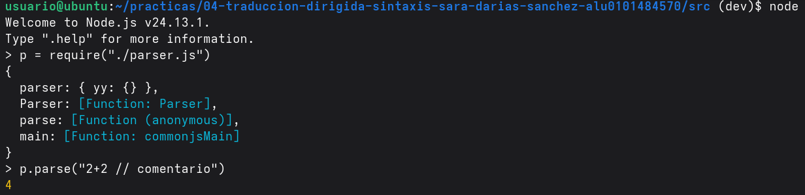
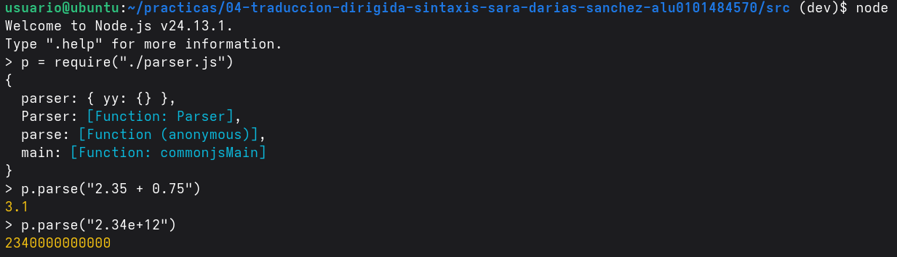
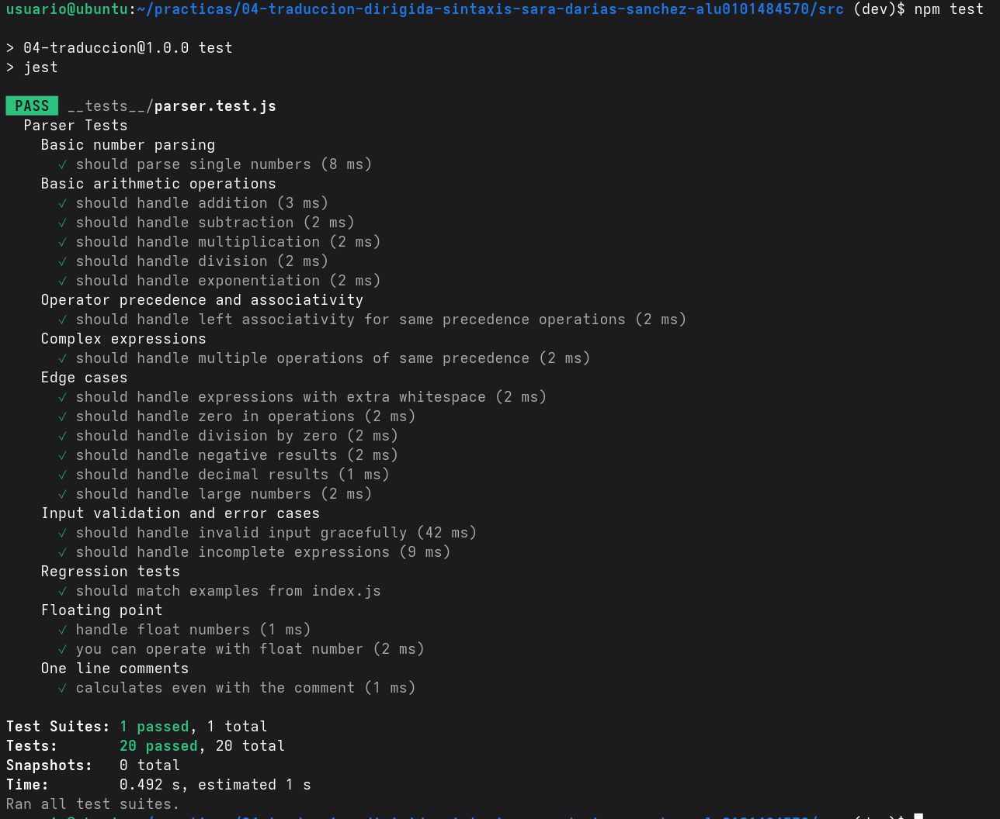

# Práctica 4 Traducción dirigida por la sintaxis: léxico
Esta es la cuarta práctica de la asignatura Procesadores de Lenguajes que es una asignatura obligatoria de la mención de computación del grado de ingeniería informática de la ULL.
##  Estructura
En esta práctica se pretende 
1 Instalar dependencias y ejecutar los test
2 Cuestiones sobre el Lexer en Jison
3 Modificar el analizador léxico de grammar.jison para que se salte los comentarios de una línea que empiezan por //.
4 Modificar el analizador léxico de grammar.jison para que reconozca números en punto flotante.
5  Añadir pruebas para las modificaciones del analizador léxico de grammar.jison.

## Instalar dependencias y ejecutar los test
Se instalaron las dependencias con ```npm install ``` y se genero el analizador sintáctico con ```npx jison src/grammar.jison -o src/parser.js``` 
### Ejecutar los test
## Cuestiones sobre el Lexeren Jison
### Describa la diferencia entre /* skip whitespace */ y devolver un token.
Cuando se devuelve un token estamos retornando el valor del identificador de ese token, como en los siguientes ejemplos:
``` JavaScript
[0-9]+ { return 'NUMBER'; }
"**" { return 'OP'; }
[-+*/] { return 'OP'; }
<<EOF>> { return 'EOF'; }
. { return 'INVALID'; }
```
Además lo que retorna se lo pasaría al analizador sintáctico 
En cambio cuando lo que estamos reconociendo son espacios en blanco, entonces lo que hacemos es saltarnos ese caracter y continuar sin devolver nada.   
``` JavaScript
\s+ { /* skip whitespace */; }
```

### Escriba la secuencia exacta de tokens producidos para la entrada 123**45+@.
123 -> NUMBER   
** -> OP    
45 -> NUMBER     
\+ -> OP   
@ -> INVALID  

### Indique por qué ** debe aparecer antes que [-+*/]
Esto se debe a que el lexer aplica las reglas en orden y si pusieramos primero [-+*/] cuando apareciera ** nunca reconocería que es el operando de potencia, sino que lo reconocería como si fueran dos operadores de multiplicación. Pero nosotros queremos que se reconozca ** como un operador distinto que *.  
Es por ello que si una el inicio de una regla coincide con el de otra debemos poner aquella que sea más larga encima.

### Explique cuándo se devuelve EOF.
EOF se devuelve al final cuando ya se ha terminado de leer todo el fichero y no queda más entrada por leer, es entonces cuando se encuentra << EOF >>.

### Explique por qué existe la regla . que devuelve INVALID.
Para poder gestionar los errores de encontrarnos con caracter un inesperado. la regla  ``` . { return 'INVALID'; } ```, se aplicara cuando el caracter encontrado no satisfaga ninguna de las otras reglas, de esta forma sabemos que para ese caracter no tiene significado para nosotros ya que no lo teníamos ni contemplado y por tanto tampoco vamos a hacer nada con el.
## Modificar grammar.js
### Modifique el analizador léxico de grammar.jison para que se salte los comentarios de una línea que empiezan por //.
Modificamos el fichero grammar.js añadiendo una línea que ponga ```"//".*  {/*skip one line comments*/;}```, esta regla debemos ponerla antes que la regla ```[-+*/]    { return 'OP';} ``` ya que sino no nos detectaría los comentarios, porque coincide con el inicio coincide con / del operador division.    
    


### Modifique el analizador léxico de grammar.jison para que reconozca números en punto flotante como 2.35e-3, 2.35e+3, 2.35E-3, 2.35 y 23.
Modificamos la regla ```[0-9]+    { return 'NUMBER';}``` y la cambiamos a    
```[0-9]+(\.[0-9]+)?([eE][-+][0-9]+)?    { return 'NUMBER';}``` para que nos reconozca los números en punto flotante.
     


### Añada pruebas para las modificaciones del analizador léxico de grammar.jison.
