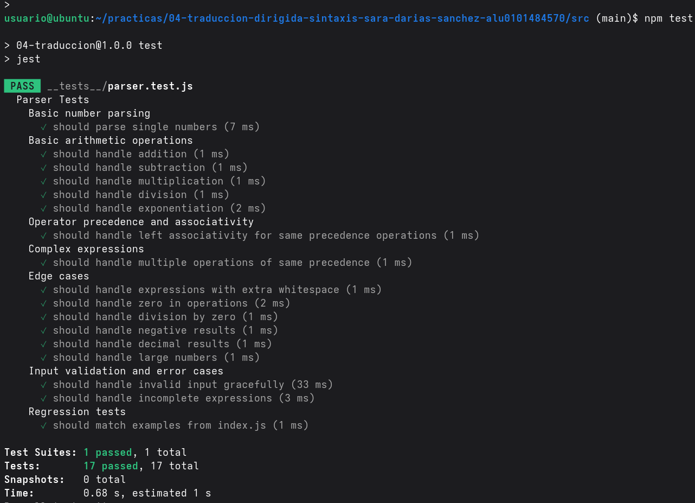
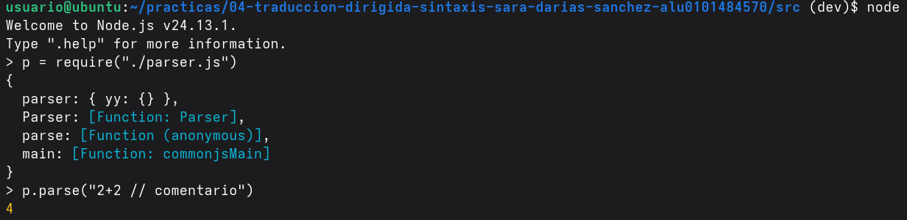
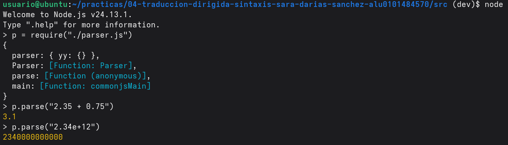
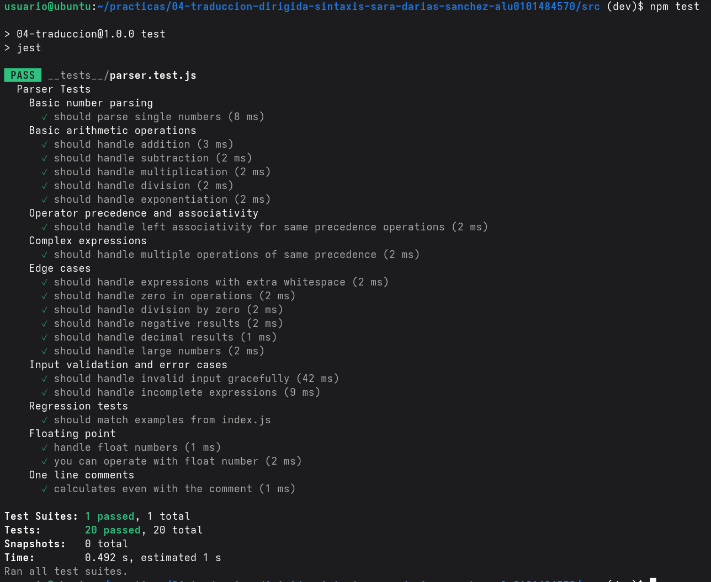
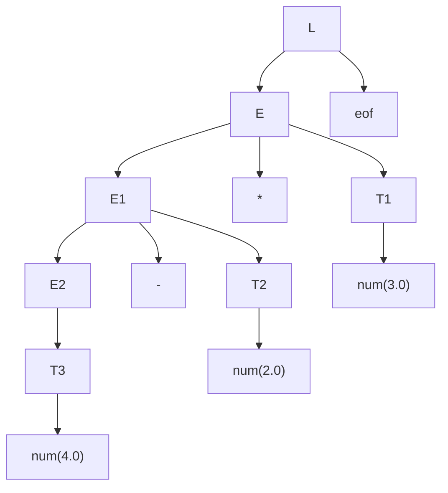
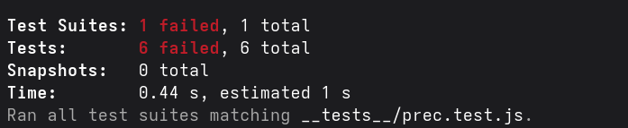
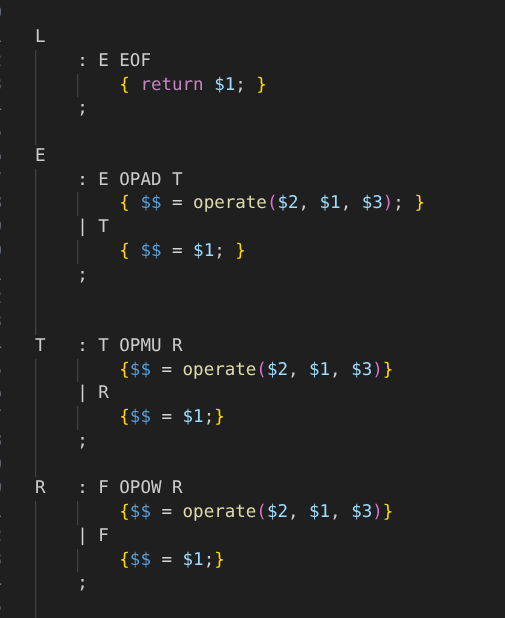
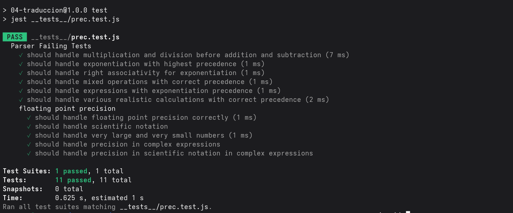
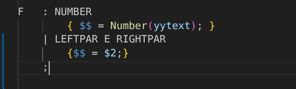
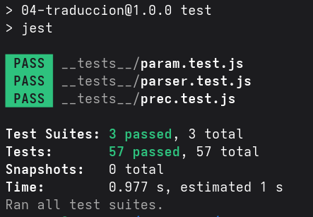

# Práctica 4 y 5 Traducción dirigida por la sintaxis: léxico y gramática
Esta es la cuarta práctica de la asignatura Procesadores de Lenguajes que es una asignatura obligatoria de la mención de computación del grado de ingeniería informática de la ULL.
##  Estructura
En esta práctica se pretende   
### Práctica 4
1. Instalar dependencias y ejecutar los test
2. Cuestiones sobre el Lexer en Jison
3. Modificar el analizador léxico de grammar.jison para que se salte los comentarios de una línea que empiezan por //.
4. Modificar el analizador léxico de grammar.jison para que reconozca números en punto flotante.
5. Añadir pruebas para las modificaciones del analizador léxico de grammar.jison.   
### Práctica 5
1. Partiendo de la gramática y las siguientes frases 4.0-2.0*3.0, 2\**3**2 y 7-4/2  
1.1. Escriba la derivación para cada una de las frases.   
1.2. Escriba el árbol de análisis sintáctico (parse tree) para cada una de las frases.   
1.3. En qué orden se evaluan las acciones semánticas para cada una de las frases?   
1.4. Añada un fichero prec.test.js al directorio \__test__ con las siguientes pruebas y compruebe que con la implementación actual fallan.
2. Modifique la gramática del fichero grammar.jison de manera que se respete la precedencia y la asociatividad de los operadores matemáticos.
3. Añada los test correspondientes para comprobar que se respeta la precedencia y asociatividad con flotantes.
4. Codifique el programa Jison para que se reconozcan expresiones entre paréntesis
5. Añada los test correspondientes para las expresiones entre paréntesis

# Práctica 4
## Instalar dependencias y ejecutar los test
Se instalaron las dependencias con ```npm install ``` y se genero el analizador sintáctico con ```npx jison src/grammar.jison -o src/parser.js``` 
### Ejecutar los test

## Cuestiones sobre el Lexeren Jison
### Describa la diferencia entre /* skip whitespace */ y devolver un token.
Cuando se devuelve un token estamos retornando el valor del identificador de ese token, como en los siguientes ejemplos:
``` JavaScript
[0-9]+ { return 'NUMBER'; }
"**" { return 'OP'; }
[-+*/] { return 'OP'; }
<<EOF>> { return 'EOF'; }
. { return 'INVALID'; }
```
Además lo que retorna se lo pasaría al analizador sintáctico 
En cambio cuando lo que estamos reconociendo son espacios en blanco, entonces lo que hacemos es saltarnos ese caracter y continuar sin devolver nada.   
``` JavaScript
\s+ { /* skip whitespace */; }
```

### Escriba la secuencia exacta de tokens producidos para la entrada 123**45+@.
123 -> NUMBER   
** -> OP    
45 -> NUMBER     
\+ -> OP   
@ -> INVALID  

### Indique por qué ** debe aparecer antes que [-+*/]
Esto se debe a que el lexer aplica las reglas en orden y si pusieramos primero [-+*/] cuando apareciera ** nunca reconocería que es el operando de potencia, sino que lo reconocería como si fueran dos operadores de multiplicación. Pero nosotros queremos que se reconozca ** como un operador distinto que *.  
Es por ello que si una el inicio de una regla coincide con el de otra debemos poner aquella que sea más larga encima.

### Explique cuándo se devuelve EOF.
EOF se devuelve al final cuando ya se ha terminado de leer todo el fichero y no queda más entrada por leer, es entonces cuando se encuentra << EOF >>.

### Explique por qué existe la regla . que devuelve INVALID.
Para poder gestionar los errores de encontrarnos con caracter un inesperado. la regla  ``` . { return 'INVALID'; } ```, se aplicara cuando el caracter encontrado no satisfaga ninguna de las otras reglas, de esta forma sabemos que para ese caracter no tiene significado para nosotros ya que no lo teníamos ni contemplado y por tanto tampoco vamos a hacer nada con el.
## Modificar grammar.js
### Modifique el analizador léxico de grammar.jison para que se salte los comentarios de una línea que empiezan por //.
Modificamos el fichero grammar.js añadiendo una línea que ponga ```"//".*  {/*skip one line comments*/;}```, esta regla debemos ponerla antes que la regla ```[-+*/]    { return 'OP';} ``` ya que sino no nos detectaría los comentarios, porque coincide con el inicio coincide con / del operador division.    
    


### Modifique el analizador léxico de grammar.jison para que reconozca números en punto flotante como 2.35e-3, 2.35e+3, 2.35E-3, 2.35 y 23.
Modificamos la regla ```[0-9]+    { return 'NUMBER';}``` y la cambiamos a    
```[0-9]+(\.[0-9]+)?([eE][-+][0-9]+)?    { return 'NUMBER';}``` para que nos reconozca los números en punto flotante.
     


### Añada pruebas para las modificaciones del analizador léxico de grammar.jison.


# Práctica 5
## Partiendo de la gramática y las siguientes frases 4.0 - 2.0 * 3.0, 2 \** 3 ** 2 y 7 - 4 / 2  
La gramática:
L → E eof    
E → E1 op T    
E → T    
T → number 
### Escriba la derivación para cada una de las frases.   
#### 4.0 - 2.0 * 3.0,
L => E eof => E * T eof => E * 3.0 eof => E - T * 3.0 eof => E - 2.0 * 3.0 eof => T - 2.0 * 3.0 eof => 4.0 - 2.0 * 3.0 eof
L => E eof => E * T eof => E - T * T eof => E - T * 3.0 eof => E - 2.0 * 3.0 eof => T - 2.0 * 3.0 eof => 4.0 - 2.0 * 3.0 eof
#### 2 ** 3 ** 2
L => E eof => E ** T eof => E ** 2 eof => E ** T ** 2 eof => E ** 3 ** 2 => T ** 3 ** 2 eof => 2 ** 3 ** 2 eof    
L => E eof => E ** T eof => E ** T ** T eof => E ** T ** 2 => E ** 3 ** 2 eof => T ** 3 ** 2 eof => 2 ** 3 ** 2 eof
#### 7 - 4 / 2 
L => E eof => E / T eof => E / 2 eof => E - T / 2 eof => E - 4 / 2 eof => T - 4 / 2 eof => 7 - 4 / 2 eof 
L => E eof => E / T eof => E - T / T eof => T - T / T eof => T - T / 2 eof => T - 4 / 2 eof => 7 - 4 / 2 eof
### Escriba el árbol de análisis sintáctico (parse tree) para cada una de las frases. 
#### 4.0 - 2.0 * 3.0,

```mermaid
graph TD
L --> E
L --> eof

E --> E1
E --> OP1
E --> T1

E1 --> E2
E1 --> OP2
E1 --> T2

E2 --> T3
T3 --> N40["num(4.0)"]

T2 --> N20["num(2.0)"]
T1 --> N30["num(3.0)"]

OP1["*"] 
OP2["-"]
```
#### 2 ** 3 ** 2
```
mermaid
graph TD
L --> E
L --> eof

E --> E1
E --> OP1
E --> T1

E1 --> E2
E1 --> OP2
E1 --> T2

E2 --> T3
T3 --> N2["num(2)"]

T2 --> N3["num(3)"]
T1 --> N22["num(2)"]

OP1["**"]
OP2["**"]
```
#### 7 - 4 / 2 
```
mermaid
graph TD
L --> E
L --> eof

E --> E1
E --> OP1
E --> T1

E1 --> E2
E1 --> OP2
E1 --> T2

E2 --> T3
T3 --> N7["num(7)"]

T2 --> N4["num(4)"]
T1 --> N2["num(2)"]

OP1["/"]
OP2["-"]
```
### En qué orden se evaluan las acciones semánticas para cada una de las frases?   
Las acciones semántixas se evaluan de **izquierda a derecha** ya que todos los operadores tienen el mismo nivel de jerarquico ya que están todos definidos mediante el mismo tojen **OP**. Al no diferenciar las distintas precedencias entre las distintas operaciones, como por ejemplo la sumas de las divisiones, el parser va a ir aplicando la función ``òperate()```segun vayan apareciendo los operaciones. Esto provoca que las operaciones en vez de seguir los convenios matemáticos siga el orden en el que se evalúa un árbol de análisis sintáctico, que es recorriendo primero el que se encuentre más anidado a la izquierda.
### Añada un fichero prec.test.js al directorio \_\_test __ con las siguientes pruebas y compruebe que con la implementación actual fallan.

## Modifique la gramática del fichero grammar.jison de manera que se respete la precedencia y la asociatividad de los operadores matemáticos.

## Añada los test correspondientes para comprobar que se respeta la precedencia y asociatividad con flotantes.

## Modifique el programa Jison para que se reconozcan expresiones entre paréntesis

## Añada los test correspondientes para las expresiones entre paréntesis
